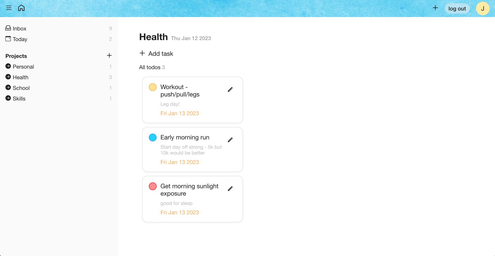

# todo-app

## [Live Demo](https://salvantjeff.github.io/todo-app/)

## Introduction

Designed an interactive to-do list application to help one achieve their daily goals. It was initially built with JS, HTML, and CSS but was rebuilt with React. Refactoring this project in React was intended to aid in its extensibility to add many new features and improvements in the future if desired. One of the newly added features was user authentication.

Enabling user authentication was accomplished by learning how to integrate different backend services to manage the database and user authentication. Ultimately, Firebase was selected as the backend system of the app.

Started researching and planning on how to structure the to-do list data. As well as how it would change over time resulted in a successful to-do list app. The focus was to reduce coupling as much as possible using separation of concerns, single responsibility principle, encapsulation principle, and abstraction. Encapsulation prevented strange side effects, and abstracting out the objects helped the data seamlessly be used elsewhere in the application.

### Languages and Tools used:

